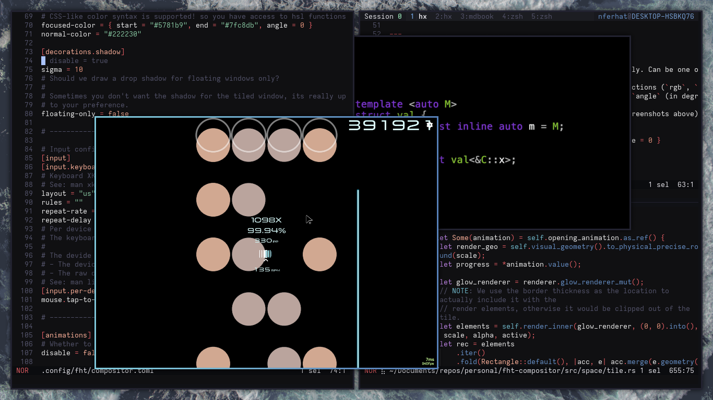

<h1 align=center>fht-compositor</h1>

A dynamic tiling Wayland compositor.

    
    

## About

`fht-compositor` is a dynamic tiling Wayland compositor that implements a window management model
inspired by X11 window managers such as [dwm](https://dwm.suckless.org) and [xmonad](https://xmonad.org)

<!-- TODO: Link with wiki layouts -->
Each output gets assigned 9 independent workspaces, each one holding windows that get automatically
arranged on the screen space using layouts, minimizing lost screen real estate, and providing a
keyboard-focused workflow

<!-- TODO: Link with features tab of wiki -->
In addition, the compositor also provides some nice-to-have features that elevate the experience
from a visual and practical standpoint, see features for more information.

## Video demo

https://github.com/user-attachments/assets/4ea9b294-85a8-49ab-9f42-2f76111f063b

