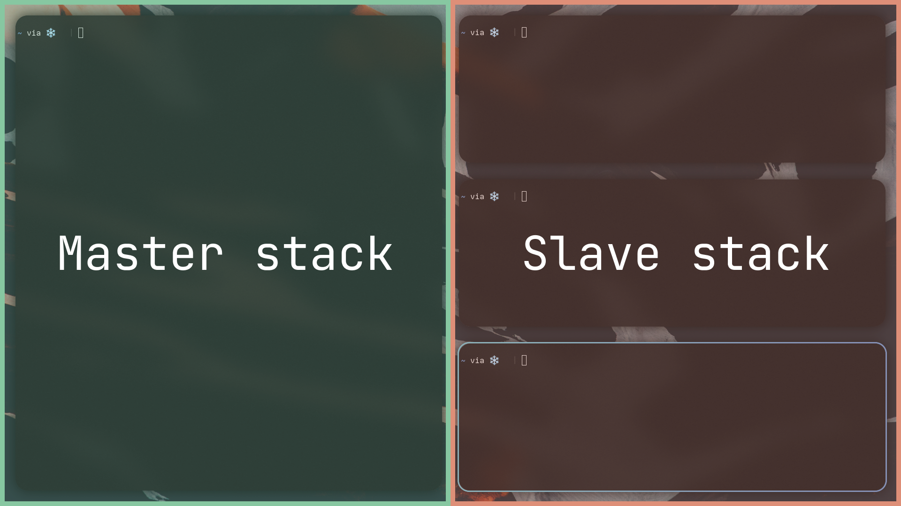

# Guided tour

## Launching

If you are on a systemd distribution, you should use the `fht-compositor (UWSM)`
option in your login manager, or launch `fht-compositor` using the following
command from another TTY

```sh
uwsm start fht-compositor-uwsm.desktop
```

If you are not using a systemd distribution, launch the compositor with

```sh
dbus-run-session fht-compositor
```

Note that many _nicetices_ that come with UWSM under a systemd distribution are
gone, notably executing graphical services with `graphical-session.target` and
XDG autostart.

---

> **NOTE**: The following assumes you are running the **default configuration**

On your first launch, you will be facing a dark gray screen with and mouse pointer
in the middle. If you switch to another TTY, you should be able to see that the compositor
generated a configuration file in `$XDG_CONFIG_HOME/fht/compositor.toml` (usually `~/.config/fht/compositor.toml`)

Now, you can hit <kbd>Super+Enter</kbd> to launch Alacritty, do that 3-5 times. You will immediatly
notice that the alacritty windows get arranged in a very interesting manner.

This kind of arragement driven by a _dynamic layout_ (term borrowed from DWM), the workspace figures
out how to organize its windows in two stacks:




1. The **master** stack: The stack containing the most important window(s), they take up the most
   screen real estate since they are the windows of focus.
2. The **slave** stack: The stack containing less important windows. They share the stack's space
   and can have their proportions altered to do a non-even share (more about that later...)

You can focus different windows by clicking on them with your mouse, or, the preferred way is to
cycle through them using <kbd>Super+j</kbd> and <kbd>Super+k</kbd>. In a similar fashion, holding
shift with the same keybinds will swap the windows around.

You can also control the size of the master stack relative to the slave one using <kbd>Super+h</kbd>
to shrink it and <kbd>Super+l</kbd> to grow it. Again, holding shift with the same keybinds will
increase/decrease the numbers of windows in the master stack.

The magic of a dynamic layout is that you can spawn whatever windows you need to work with, and
swiftly arrange them to get the workflow that you need and get started with work. No need to mess
around with split directions, colums, trees, or anything!

You have 9 workspaces to work with, switch through them using <kbd>Super+[1-9]</kbd>, or send the
currently focused window to one using <kbd>Super+Shift+[1-9]</kbd>

Great! Now, you should install some of the [recommended software](./recommended-software.md) to
get the best experience with the compositor.
